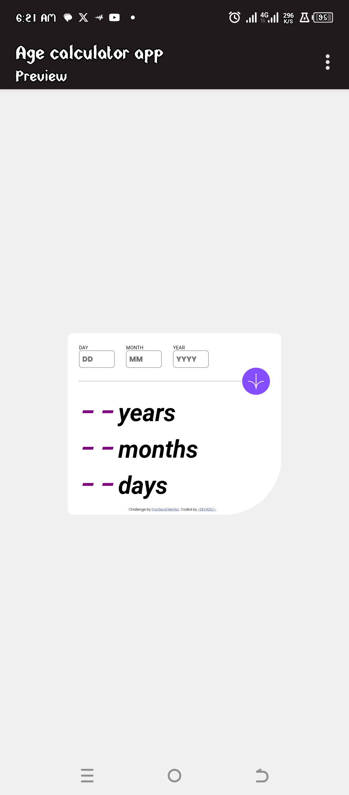

# Frontend Mentor - Blog Card Preview solution

This is a solution to the [Age Challenge on Frontend Mentor](https://www.frontendmentor.io/challenges/blog-preview-card-ckPaj01IcS). 

## Table of contents

- [Overview] 
  - [Screenshot] (#screenshot)
  - [Links](#links)
- [My process](#my-process)
  - [Built with](#built-with)
  - [What I learned](#what-i-learned)
- [Author](#author)
- [Acknowledgments](#acknowledgments)

## Overview

### Screenshot

### Links

- Solution URL: [solution URL ](https://ademedia.github.io/age-calculator/)
- Live Site URL: [/ive site URL ](https://ademedia.github.io/age-calculator/)

## My process

**HTML Structure**

I started by using a by creating a main element  with class "age-container" and then put another div inside named "container".

I placed the Card image inside the preview div.

I create another the footer for attribution to frontEnd mentor and to myself.

**CSS Styling**
I add the font-family to my css file by using the @facefont rule. 

I add a universal selector(*) to set margin and padding to 0.

Then use the body selector to add background-color and other styles to the body.

### Built with
- Semantic HTML tags
- CSS custom properties
- Flexbox

### What I learned
 
 This help me to understand CSS flexbox more.
 I'll be trying Grid layout soon 🔜.

## Author

- Website - [<DEVADE/>](https://www.github/ademedia.io)
- Frontend Mentor - [DEVADE](https://www.frontendmentor.io/profile/ademedia)
- Twitter - [AdeDevgee](https://www.x.com/adeDevgee)

## Acknowledgments

Thanks to Front-end mentor for the instructions.
